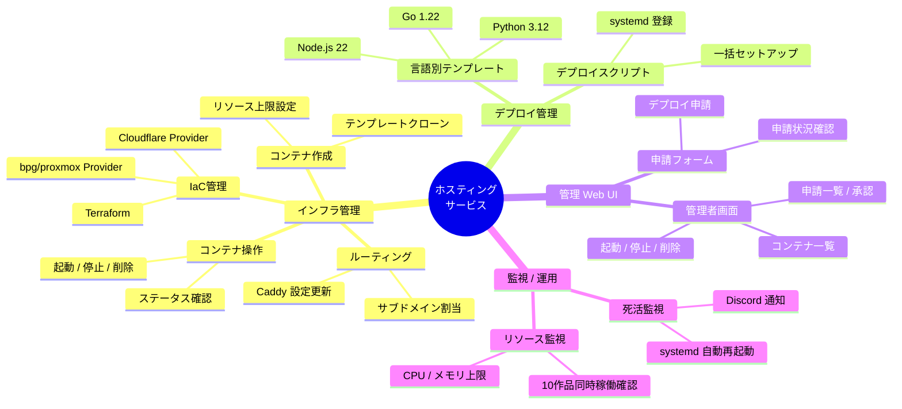
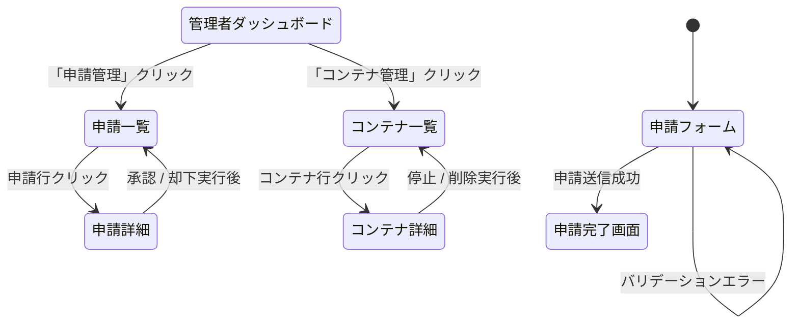
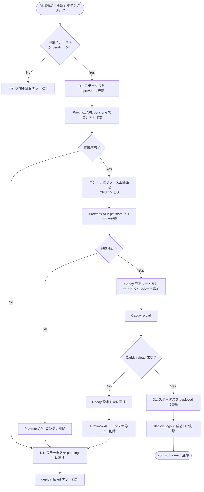
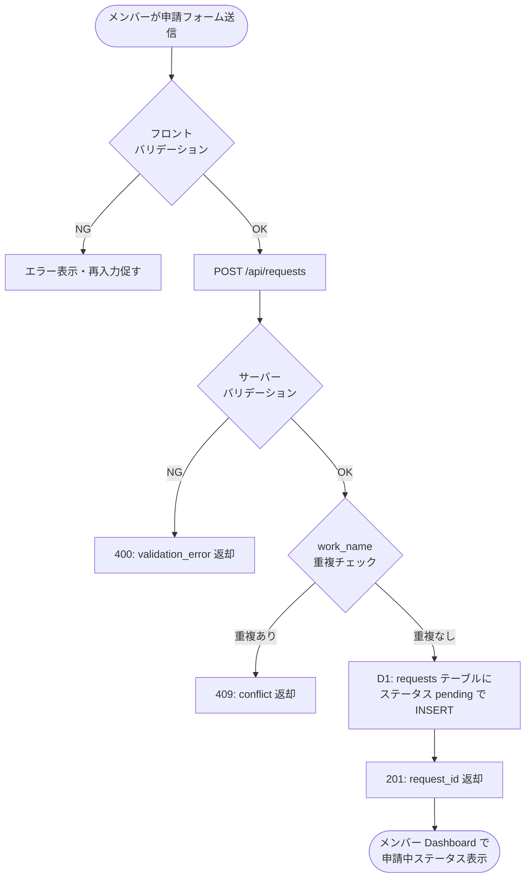
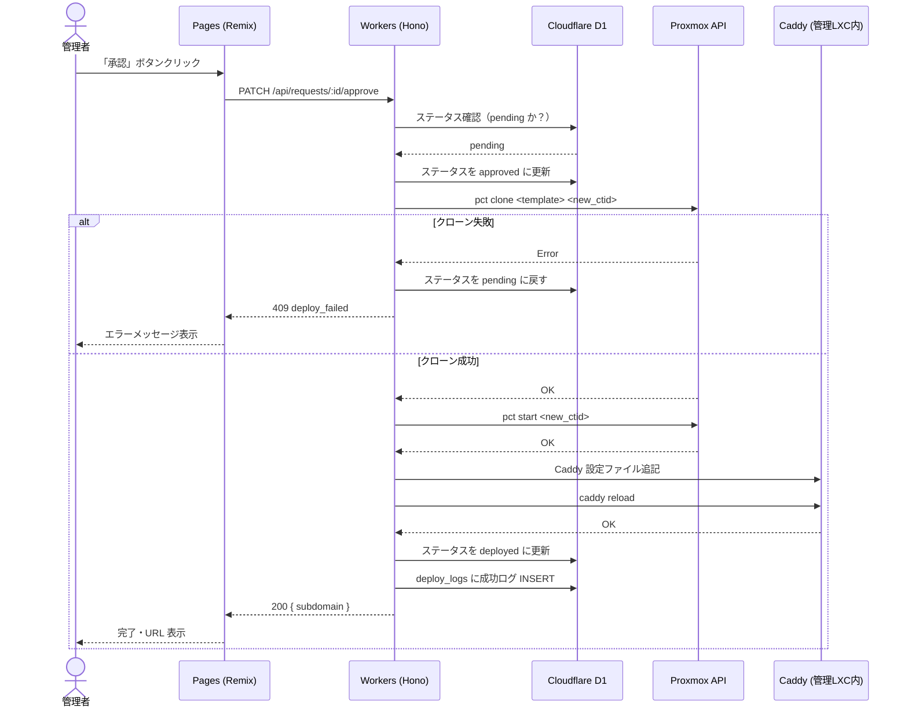
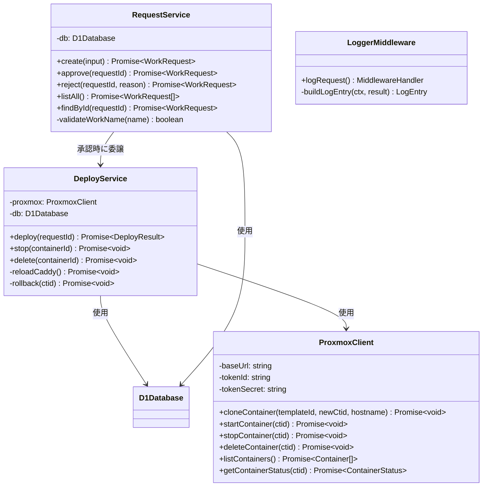

# デザインドック：サークル作品ホスティングサービス

> **作成者：** 柳井  
> **対象フェーズ：** Phase 1〜3（Phase 4 は将来ドキュメント）  
> **品質目標：** 正しく動く ＋ 変えやすい ＋ 運用できる

---

## 0. 解決する課題

| 項目 | 内容 |
|------|------|
| **問題** | サークルメンバーが制作したバックエンド常時稼働 Web アプリを公開・運用できる場所がない |
| **対象ユーザー** | サークルメンバー 10名以上・作品閲覧者（ポートフォリオ/文化祭） |
| **成功条件** | 同時 10 作品以上を常時稼働ホスティング、メンバー費用 月額 0 円 |
| **スコープ外** | 静的サイト、冗長化、独自ドメイン個別対応、Git 自動デプロイ（Phase 4）、**認証・ログイン機能（将来対応）** |

---

## 1. 基本設計

### 1.1 システム全体像

```
[メンバー] ──フォーム申請──▶ [管理 Web UI]
                                │ Cloudflare Pages (React)
                                │ Cloudflare Workers (Hono API)
                                │ Cloudflare D1 (DB)
                                ▼
                         [Proxmox API]
                                │
          ┌─────────────────────┼──────────────────────┐
          │                     │                      │
    [LXC: 管理]          [LXC: 作品A]           [LXC: 作品B]
    Caddy + cloudflared   Node.js + systemd     Python + systemd
          │
    Cloudflare Tunnel
          │
   {作品名}.example.dev ──▶ 外部インターネット
```

**設計の3原則適用：**

| 原則 | 本プロジェクトでの実装 |
|------|---------------------|
| 単一責任 | LXC 1コンテナ = 1作品。ルーティングは管理 LXC のみ担当 |
| 拡張性 | `pct clone` でテンプレート複製。新言語追加は新テンプレート1つのみ |
| 非依存 | Cloudflare Tunnel でポート開放ゼロ。ISP 都合に引きずられない |

---

### 1.2 機能一覧



**機能優先度：**

| 機能 | 優先度 | フェーズ | 備考 |
|------|:---:|------|------|
| Proxmox + LXC テンプレート | 最高 | Phase 1 | MVP の核心 |
| Cloudflare Tunnel 外部公開 | 最高 | Phase 1 | MVPの完成条件 |
| デプロイスクリプト | 高 | Phase 2 | 管理者運用の効率化 |
| 言語別テンプレート | 高 | Phase 2 | 作品対応範囲の拡大 |
| **IaC によるリソース管理** | **高** | **Phase 2** | **Terraform + Cloudflare Provider** |
| 管理 Web UI（申請・承認） | 中 | Phase 3 | メンバー自己申請を実現 |
| 認証・ログイン機能 | 低 | 将来 | 現フェーズはスコープ外 |
| Git push 自動デプロイ | 低 | Phase 4 | 将来対応 |

---

### 1.3 画面設計・画面遷移



**画面定義書：**

| 画面名 | URL | 主要要素 |
|--------|-----|---------|
| 申請フォーム | `/apply` | 作品名（必須/最大50字）、リポジトリURL（必須）、言語選択（必須）、申請者名（必須）、説明（任意/最大500字） |
| 申請完了 | `/apply/done` | 申請番号・ステータス確認メッセージ |
| 管理者Dashboard | `/admin` | 未承認申請数・稼働コンテナ数 |
| 申請一覧 | `/admin/requests` | 申請一覧テーブル（フィルタ/ソート付き） |
| 申請詳細 | `/admin/requests/:id` | 申請内容・承認/却下ボタン |
| コンテナ一覧 | `/admin/containers` | 稼働中コンテナ一覧・リソース使用率 |
| コンテナ詳細 | `/admin/containers/:id` | コンテナ情報・起動/停止/削除ボタン |

---

### 1.4 権限設計

> **認証・ログイン機能は現フェーズのスコープ外。**

現在の運用方針：
- **申請フォーム（`/apply`）** は誰でもアクセス可能（URL を知っているメンバーが使用）
- **管理者画面（`/admin`）** は Cloudflare Access（外部サービス）でアクセス制限し、アプリ内には認証ロジックを持たない
- ロールベースの権限制御（RBAC）は将来フェーズで実装

---

### 1.5 運用設計

**SLI/SLO：**

| SLI | SLO | 測定方法 |
|-----|-----|---------|
| 外形可用性 | 月間 99% 以上 | Cloudflare Tunnel 疎通監視 |
| デプロイ完了時間 | 承認後 5 分以内 | スクリプト実行時間計測 |
| 障害検知時間（MTTD） | 5 分以内 | systemd 監視 + Discord 通知 |

**監視方針（優先順位：外形 ＞ 依存先 ＞ 内部）：**

| 層 | 監視対象 | 手段 | 通知先 |
|----|---------|------|--------|
| 外形 | `https://{作品名}.example.dev` 疎通 | cloudflared ヘルスチェック | Discord |
| 依存先 | Cloudflare Tunnel 接続状態 | cloudflared ステータス | Discord |
| 内部 | 各コンテナ systemd サービス死活 | `systemd` OnFailure= | Discord |
| 内部 | ホスト CPU / メモリ使用率 | Proxmox ビルトイン | Web UI アラート |

---

## 2. 詳細設計

### 2.1 アーキテクチャ構造

```
src/
├── workers/              # Cloudflare Workers (Hono)
│   ├── index.ts          # エントリーポイント・ルーティング
│   ├── routes/
│   │   ├── requests.ts   # 申請 CRUD
│   │   └── containers.ts # Proxmox API プロキシ
│   ├── middleware/
│   │   └── logger.ts     # 構造化ログ出力
│   ├── services/
│   │   ├── proxmox.ts    # Proxmox API クライアント
│   │   └── deploy.ts     # デプロイロジック
│   └── db/
│       └── schema.ts     # D1 スキーマ定義
└── pages/                # Cloudflare Pages (Remix)
    ├── components/
    ├── pages/
    └── hooks/
```

**レイヤー責務：**

| レイヤー | 責務 | 依存方向 |
|---------|------|---------|
| `routes/` | HTTP リクエスト受付・レスポンス整形 | → services |
| `middleware/` | ログ横断処理 | → db |
| `services/` | ビジネスロジック・外部API呼び出し | → db |
| `db/` | D1 クエリのみ。ビジネスロジックを持たない | なし |

---

### 2.2 DB 論理設計（ER 図）

```mermaid
erDiagram
    work_requests {
        TEXT request_id PK "UUID"
        TEXT applicant_name "申請者名"
        TEXT work_name UK "サブドメインに使用"
        TEXT repo_url "GitHubリポジトリURL"
        TEXT language "nodejs / python / go"
        TEXT description "作品説明（任意）"
        TEXT status "pending / approved / rejected / deployed / stopped"
        TEXT rejected_reason "却下理由（任意）"
        TEXT created_at "ISO 8601 UTC"
        TEXT updated_at "ISO 8601 UTC"
    }

    containers {
        TEXT container_id PK "Proxmox CTID"
        TEXT request_id FK UK
        TEXT hostname "LXC ホスト名"
        TEXT subdomain "{work_name}.example.dev"
        INTEGER cpu_limit "コア数上限"
        INTEGER memory_limit_mb "メモリ上限(MB)"
        TEXT status "running / stopped / error"
        TEXT created_at "ISO 8601 UTC"
    }

    deploy_logs {
        TEXT log_id PK "UUID"
        TEXT request_id FK
        TEXT action "deploy / start / stop / delete"
        TEXT status "success / failure"
        TEXT message "詳細メッセージ"
        TEXT created_at "ISO 8601 UTC"
    }

    work_requests ||--o| containers : "デプロイされる"
    work_requests ||--o{ deploy_logs : "ログが記録される"
```

---

### 2.3 API 仕様書

#### 認証

> **認証は現フェーズのスコープ外。`/admin` 配下は Cloudflare Access で外部保護する。**

---

#### 申請管理

| メソッド | パス | 説明 |
|---------|------|------|
| `GET` | `/api/requests` | 申請一覧（全件） |
| `POST` | `/api/requests` | 新規申請 |
| `GET` | `/api/requests/:id` | 申請詳細 |
| `PATCH` | `/api/requests/:id/approve` | 承認＆デプロイ実行 |
| `PATCH` | `/api/requests/:id/reject` | 却下 |

**`POST /api/requests`**

```json
// Request
{
  "applicant_name": "柳井",              // 必須・最大50字
  "work_name": "my-app",               // 必須・英数字ハイフン・最大30字
  "repo_url": "https://github.com/user/repo",  // 必須・URL形式
  "language": "nodejs",                // 必須・nodejs | python | go
  "description": "説明文"              // 任意・最大500字
}

// Response 201
{ "request_id": "uuid", "status": "pending" }

// Response 400（バリデーションエラー）
{ "error": "validation_error", "fields": { "work_name": "使用できない文字が含まれています" } }

// Response 409（重複）
{ "error": "conflict", "message": "そのwork_nameは既に使用されています" }
```

**`PATCH /api/requests/:id/approve`**

```json
// Response 200
{ "request_id": "uuid", "status": "deployed", "subdomain": "my-app.example.dev" }

// Response 409（デプロイ失敗）
{ "error": "deploy_failed", "message": "コンテナ作成に失敗しました", "detail": "..." }
```

---

#### コンテナ管理

| メソッド | パス | 説明 |
|---------|------|------|
| `GET` | `/api/containers` | 稼働コンテナ一覧 |
| `GET` | `/api/containers/:id` | コンテナ詳細・リソース使用率 |
| `POST` | `/api/containers/:id/start` | コンテナ起動 |
| `POST` | `/api/containers/:id/stop` | コンテナ停止 |
| `DELETE` | `/api/containers/:id` | コンテナ削除（D1 レコードも削除） |

**エラーコード一覧：**

| コード | HTTP | 意味 |
|--------|:---:|------|
| `not_found` | 404 | リソースが存在しない |
| `validation_error` | 400 | 入力バリデーション失敗 |
| `conflict` | 409 | 重複または状態不整合 |
| `deploy_failed` | 409 | Proxmox API でのデプロイ失敗 |
| `internal_error` | 500 | サーバー内部エラー |

---

### 2.4 処理フロー図（デプロイ承認フロー）



---

### 2.5 処理フロー図（申請フォーム送信フロー）



---

### 2.6 シーケンス図（デプロイ承認フロー）



---

### 2.7 クラス図（Workers サービス層）



---

### 2.8 境界条件・異常系定義

#### 申請フォーム（`POST /api/requests`）

| フィールド | 正常系 | 境界条件 | 異常系 |
|-----------|--------|---------|--------|
| `applicant_name` | 1〜50字 | 1字ちょうど / 50字ちょうど | 空文字・51字超 |
| `work_name` | 英小文字・数字・ハイフン、3〜30字 | 3字ちょうど / 30字ちょうど | 空文字・記号・日本語・重複 |
| `repo_url` | `https://github.com/` で始まる URL | 末尾スラッシュあり/なし | HTTP スキーム・ローカル URL |
| `language` | `nodejs` / `python` / `go` | - | 上記以外の文字列・空文字 |
| `description` | 0〜500字 | 500字ちょうど | 501字超 |

#### デプロイ処理

| 異常系 | 対処 |
|--------|------|
| Proxmox API タイムアウト（30秒） | 409 deploy_failed。D1 ステータスを pending に戻す |
| コンテナ起動失敗 | クローン済みコンテナを削除してロールバック |
| Caddy reload 失敗 | コンテナを停止・削除してロールバック。Caddy 設定を復元 |
| 二重承認（同時リクエスト） | D1 の楽観的ロック（`updated_at` 比較）で検知 → 409 conflict |
| `work_name` が重複（申請後に重複） | D1 の UNIQUE 制約違反 → 409 conflict |

---

### 2.9 ログ設計

**形式：JSON 構造化ログ（Cloudflare Workers の `console.log`）**

```json
{
  "timestamp": "2025-04-01T10:00:00.000Z",
  "level": "info",
  "requestId": "550e8400-e29b-41d4-a716-446655440000",
  "operation": "deploy.approve",
  "target": "work_request/req-uuid",
  "outcome": "success",
  "durationMs": 3420,
  "message": "Container deployed: ctid=201 subdomain=my-app.example.dev"
}
```

**ログレベル基準：**

| レベル | 使用条件 | 例 |
|--------|---------|-----|
| `error` | 即座に人間が対応すべき事象 | デプロイ失敗・Proxmox API 接続不能 |
| `warn` | 注意が必要だが自動復旧する | Caddy reload リトライ成功 |
| `info` | 正常な操作ログ（全 API 操作） | 申請作成・承認・コンテナ停止 |
| `debug` | 開発時のみ有効化 | Proxmox API レスポンス詳細 |

**禁止事項：**

- Proxmox API トークンのログ出力禁止

---

## 3. IaC 設計（Terraform）

### 3.1 方針

| 項目 | 内容 |
|------|------|
| **ツール** | Terraform（Terraform の OSS フォーク） |
| **管理対象** | Proxmox LXC・Cloudflare DNS・Cloudflare Tunnel・D1・Pages |
| **管理外** | LXC 内部のアプリ設定（systemd 等。Ansible または deploy スクリプトが担当） |
| **state 保管** | Cloudflare R2（無料枠）または Terraform Cloud（無料枠） |
| **導入タイミング** | Phase 1 手動構築完了後に `terraform import` で既存リソースを取り込む |

### 3.2 Provider 構成

```hcl
# versions.tf
terraform {
  required_providers {
    proxmox = {
      source  = "bpg/proxmox"
      version = "~> 0.66"
    }
    cloudflare = {
      source  = "cloudflare/cloudflare"
      version = "~> 4.0"
    }
  }
  backend "s3" {
    # Cloudflare R2 を S3 互換ストレージとして使用
    bucket                      = "tofu-state"
    endpoint                    = "https://<account_id>.r2.cloudflarestorage.com"
    region                      = "auto"
    skip_credentials_validation = true
    skip_metadata_api_check     = true
    skip_region_validation      = true
    force_path_style            = true
  }
}
```

### 3.3 ディレクトリ構成

```
infra/
├── versions.tf        # Provider・backend 定義
├── variables.tf       # 変数定義
├── main.tf            # Proxmox LXC リソース
├── cloudflare.tf      # DNS・Tunnel・D1・Pages
├── outputs.tf         # IPアドレス等の出力
└── works.auto.tfvars  # 作品一覧（ここを編集して apply）
```

### 3.4 作品管理の例

```hcl
# works.auto.tfvars（作品追加・削除はここだけ編集）
works = {
  "my-app" = {
    language = "nodejs"
    memory   = 512
    cores    = 1
  }
  "cool-game" = {
    language = "python"
    memory   = 768
    cores    = 1
  }
}
```

```hcl
# main.tf
variable "works" {
  type = map(object({
    language = string
    memory   = number
    cores    = number
  }))
}

locals {
  template_ids = {
    nodejs = 200
    python = 201
    go     = 202
  }
}

resource "proxmox_virtual_environment_container" "work" {
  for_each    = var.works
  node_name   = "pve"
  description = "作品: ${each.key}"

  clone {
    vm_id = local.template_ids[each.value.language]
  }

  initialization {
    hostname = each.key
  }

  cpu    { cores = each.value.cores }
  memory { dedicated = each.value.memory }

  network_interface {
    name   = "eth0"
    bridge = "vmbr0"
  }
}

# Cloudflare DNS（サブドメイン自動登録）
resource "cloudflare_record" "work" {
  for_each = var.works
  zone_id  = var.cloudflare_zone_id
  name     = each.key
  value    = var.tunnel_cname
  type     = "CNAME"
  proxied  = true
}
```

### 3.5 Workers API との役割分担

```
【リソースのライフサイクル】

作品追加（月1〜2件）
  → works.auto.tfvars を編集
  → git commit & push
  → terraform apply（管理者が手動 or CI で実行）
  → LXC 作成・DNS 登録が完了

作品の日常操作（起動・停止・ステータス確認）
  → 管理 Web UI（Workers API）が担当
  → Terraform は関与しない

作品削除
  → works.auto.tfvars から削除
  → terraform apply で LXC + DNS レコードが消える
```

> **Workers API は「操作」、Terraform は「存在定義」** を担う。責務が明確に分離される。

### 3.6 Cloudflare リソースの IaC 管理

```hcl
# cloudflare.tf
resource "cloudflare_d1_database" "main" {
  account_id = var.cloudflare_account_id
  name       = "hosting-db"
}

resource "cloudflare_pages_project" "admin" {
  account_id        = var.cloudflare_account_id
  name              = "hosting-admin"
  production_branch = "main"
}

resource "cloudflare_zero_trust_tunnel_cloudflared" "main" {
  account_id = var.cloudflare_account_id
  name       = "hosting-tunnel"
  secret     = var.tunnel_secret
}
```

---

## 4. CI/CD 設計

### 4.1 ツールチェーン（フロントエンド / バックエンド共通）

| ツール | 役割 | 実行タイミング |
|--------|------|:------------:|
| `oxlint` | Lint | PR |
| `oxc formatter` | フォーマットチェック | PR |
| `@typescript/native-preview`（tsgo） | 型チェック | PR |
| `stylelint` + `stylelint-config-standard-scss` | SCSS Lint | PR |
| `knip` | 未使用コード・ファイル検出 | PR |
| `similarity-ts` | 重複コード検出（警告のみ） | PR |

**CI 実行順序（速い順に落とす）：**

```
oxlint → oxc format → stylelint → tsgo → knip → similarity-ts
```

### 4.2 stylelint 設定（SCSS）

```json
// .stylelintrc.json
{
  "extends": [
    "stylelint-config-standard-scss",
    "stylelint-config-recess-order"
  ],
  "rules": {
    "selector-class-pattern": "^[a-z][a-z0-9-_]*$",
    "scss/at-rule-no-unknown": true,
    "no-descending-specificity": true
  }
}
```

`stylelint-config-recess-order` でプロパティ順序（位置 → サイズ → 色 → その他）を統一する。

### 4.3 ワークフロー構成

```
PR 作成
  ├─ [quality] oxlint / oxc format / stylelint / tsgo / knip / similarity-ts
  └─ [iac-plan] terraform plan → 結果を PR コメントに自動投稿

main マージ
  ├─ [deploy-api]  wrangler deploy（Workers API → Cloudflare）
  ├─ [deploy-ui]   wrangler pages deploy（Remix → Cloudflare Worker）
  └─ [iac-apply]   terraform apply（infra/ 変更時のみ）
```

### 4.4 必要な Secrets

| Secret 名 | 内容 |
|-----------|------|
| `CLOUDFLARE_API_TOKEN` | Workers + Pages + D1 書き込み権限 |
| `CLOUDFLARE_ACCOUNT_ID` | Cloudflare アカウント ID |
| `PROXMOX_TOKEN_ID` | `user@pam!token-name` 形式 |
| `PROXMOX_TOKEN_SECRET` | Proxmox API トークンシークレット |

### 4.5 similarity-ts の段階的導入

初期は `--no-fail-on-match` で警告のみ運用し、コードベースが安定してから fail 条件に昇格させる。

```bash
# 初期：警告のみ
similarity-ts src/ --threshold 0.8 --no-fail-on-match

# 安定後：CI を落とす
similarity-ts src/ --threshold 0.85
```

---

## 5. 制約・非機能要件

### 5.1 性能

| 指標 | 目標値 | 根拠 |
|------|--------|------|
| コンテナ数 | 同時 10 以上 | サークルメンバー 10名以上の要件 |
| メモリ / コンテナ | 上限 512MB | ホスト 16GB 想定で 10コンテナ = 5GB + OS余裕 |
| CPU / コンテナ | 上限 1コア | ホスト 4コア以上想定 |
| API レスポンス | p95 < 500ms | Cloudflare Edge での実行 |

### 3.2 可用性

| コンポーネント | 冗長化方針 | 障害時の挙動 |
|--------------|---------|------------|
| Proxmox ホスト | なし（1台構成。Phase 1 制約） | 全サービス停止 |
| 管理 Web UI | Cloudflare Pages（エッジ冗長） | 申請不可のみ。稼働中コンテナは継続 |
| Cloudflare Tunnel | cloudflared の自動再接続 | 一時切断後自動復旧 |

### 3.3 セキュリティ

| 対策 | 内容 |
|------|------|
| ポート開放ゼロ | Cloudflare Tunnel のみで公開。ファイアウォール全閉鎖 |
| コンテナ間隔離 | 各作品は独立 LXC。他作品のプロセス・ファイルに触れない |
| 管理 UI アクセス制限 | Cloudflare Access（外部サービス）で `/admin` 配下を保護。アプリ内に認証ロジックなし |
| Proxmox API トークン | 最小権限スコープのトークンを Workers の環境変数に保持 |
| LXC ユーザー権限 | アプリ実行ユーザーは非 root（専用ユーザー作成） |

### 3.4 コスト

| 項目 | 費用 | 備考 |
|------|------|------|
| サーバー電気代 | 月数百円 | 常時稼働 |
| ドメイン | 年 〜$10 | `.dev` ドメイン |
| Cloudflare Workers | 無料枠内 | 10万リクエスト/日 |
| Cloudflare Pages | 無料枠内 | - |
| Cloudflare D1 | 無料枠内 | 5GB・500万行/月 |
| **合計** | **月額 数百円** | **メンバー費用 0円** |

---

## 6. フォールバック計画

| トリガー | フォールバック手段 |
|---------|----------------|
| 特定言語が LXC で動かない | その言語のみ `nesting=1` で LXC + Docker Engine |
| Proxmox VE 自体が困難 | ベアメタル Ubuntu Server + systemd 単体構成 |
| Phase 3 管理 UI が複雑すぎる | HTML フォーム + シェルスクリプト Webhook で代替 |

---

## 7. 参考資料

- [Proxmox VE 公式ドキュメント - Linux Container](https://pve.proxmox.com/wiki/Linux_Container)
- [Cloudflare Workers ドキュメント](https://developers.cloudflare.com/workers/)
- [Cloudflare Tunnel ドキュメント](https://developers.cloudflare.com/cloudflare-one/connections/connect-networks/)
- [Hono フレームワーク](https://hono.dev/)
- [Terraform ドキュメント](https://opentofu.org/docs/)
- [bpg/proxmox Terraform Provider](https://registry.terraform.io/providers/bpg/proxmox/latest/docs)
- [Cloudflare Terraform Provider](https://registry.terraform.io/providers/cloudflare/cloudflare/latest/docs)
- 「Proxmoxで作る超便利な自宅サーバーレシピ 第2版」佐藤陽月 著
