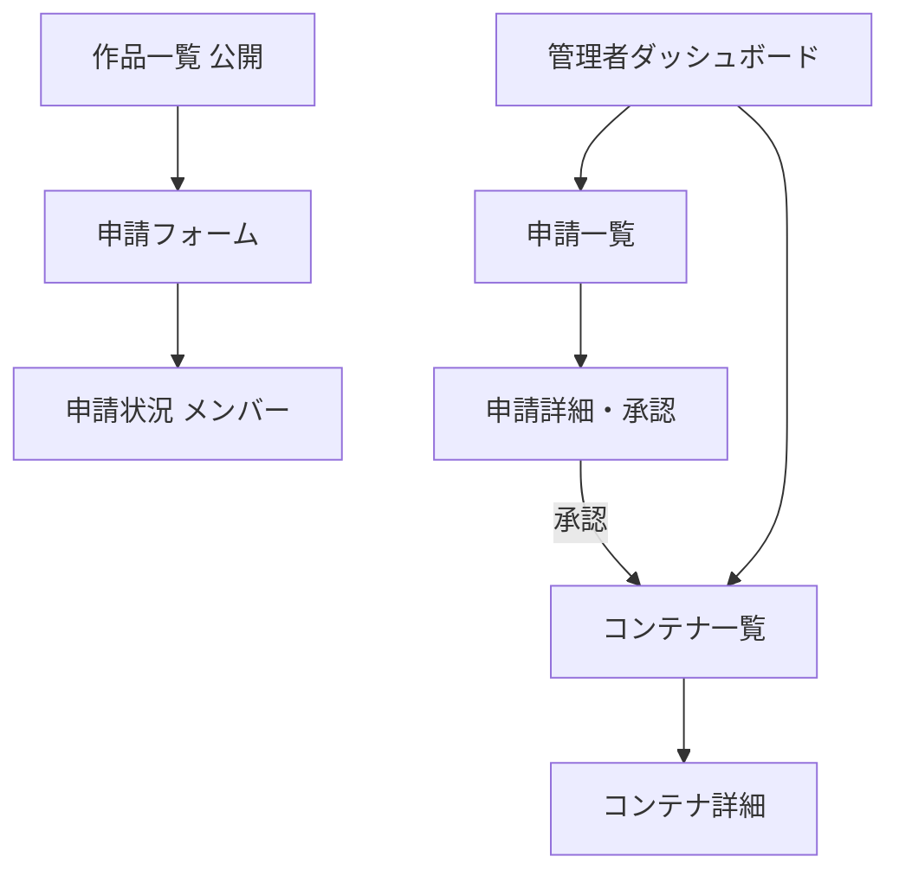
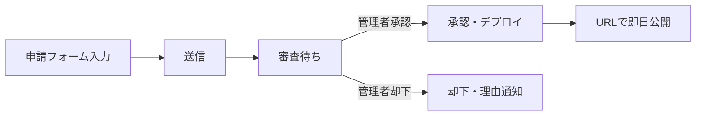
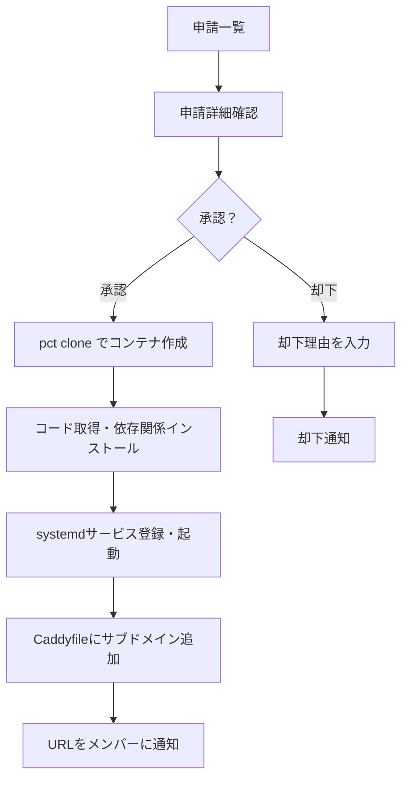
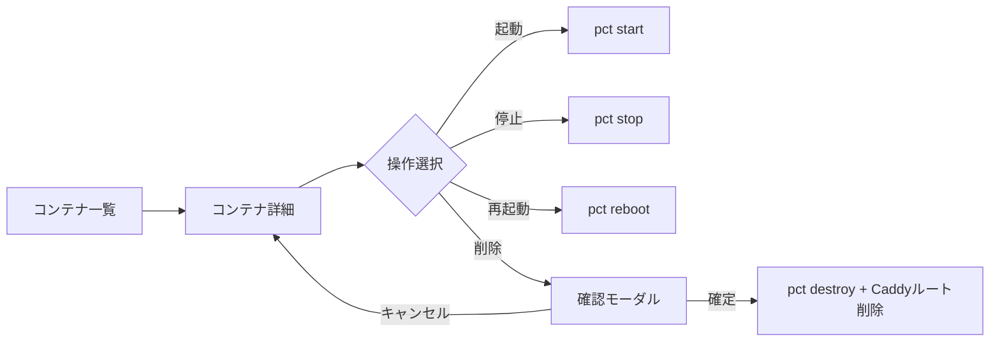
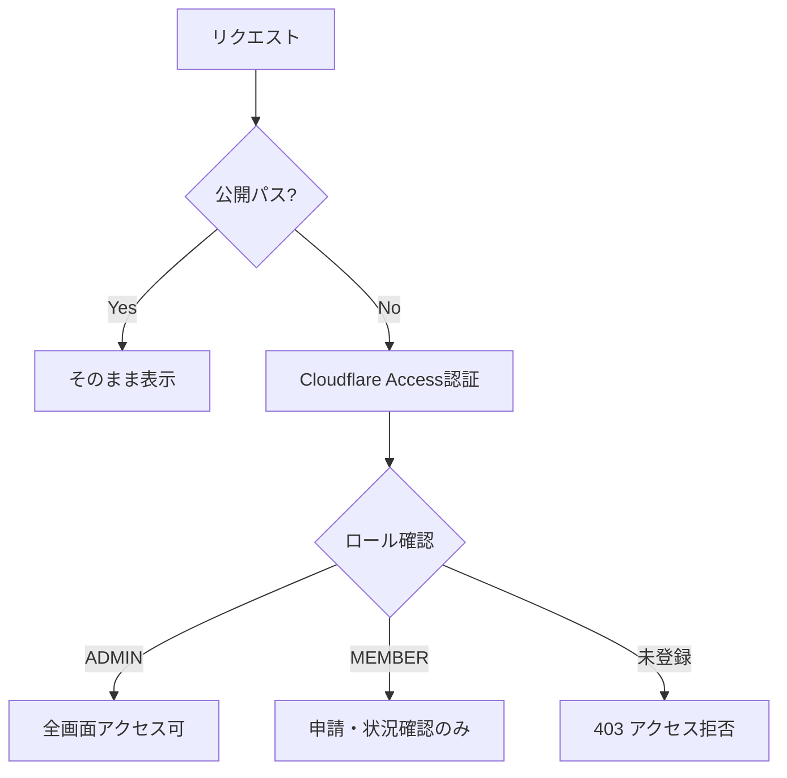

# 🖥️ 画面フロー設計：jyogiverse 管理UI

---

# 0️⃣ 設計前提

| 項目     | 内容                                          |
| ------ | ------------------------------------------- |
| 対象ユーザー | サークルメンバー（申請者）/ 管理者（柳井）/ 一般閲覧者              |
| デバイス   | Desktop優先（Responsive対応）                     |
| 認証要否   | 公開ページあり / 管理画面はCloudflare Access（Google認証）  |
| 権限制御   | RBAC（ADMIN / MEMBER / PUBLIC）                |
| MVP範囲  | Phase 3 P0画面のみ（S-02〜S-05）                   |

---

# 1️⃣ 画面一覧（Screen Inventory）

| ID   | 画面名            | 役割                   | 認証      | 優先度 | Phase |
| ---- | -------------- | -------------------- | ------- | --- | ----- |
| S-01 | 作品一覧（公開）       | 公開中の作品をカード形式で一覧表示    | 不要      | P1  | 3     |
| S-02 | 申請フォーム         | メンバーがホスティング申請を送信     | 不要      | P0  | 3     |
| S-03 | 管理者ダッシュボード     | 申請・コンテナ状況の概要を確認      | 管理者     | P0  | 3     |
| S-04 | 申請一覧（管理者）      | 未承認・全申請の一覧確認         | 管理者     | P0  | 3     |
| S-05 | 申請詳細・承認操作      | 申請内容確認・承認 / 却下       | 管理者     | P0  | 3     |
| S-06 | コンテナ一覧（管理者）    | 稼働中コンテナ一覧と状態確認       | 管理者     | P1  | 3     |
| S-07 | コンテナ詳細         | 個別コンテナの詳細確認・起動/停止操作  | 管理者     | P1  | 3     |
| S-08 | 申請状況確認（メンバー）   | 自分の申請の進捗・結果確認        | メンバー    | P1  | 3     |

---

# 2️⃣ 全体遷移図



---

# 3️⃣ 申請フロー（メンバー視点）



---

# 4️⃣ 承認・デプロイフロー（管理者視点）



---

# 5️⃣ コンテナ操作フロー（管理者視点）



---

# 6️⃣ 認証・権限フロー



---

# 7️⃣ URL設計

```
/                          # 作品一覧（公開）
/apply                     # 申請フォーム（公開）
/status                    # 申請状況確認（メンバー認証）
/admin                     # 管理者ダッシュボード
/admin/applications        # 申請一覧
/admin/applications/:id    # 申請詳細・承認操作
/admin/containers          # コンテナ一覧
/admin/containers/:id      # コンテナ詳細・操作
```
