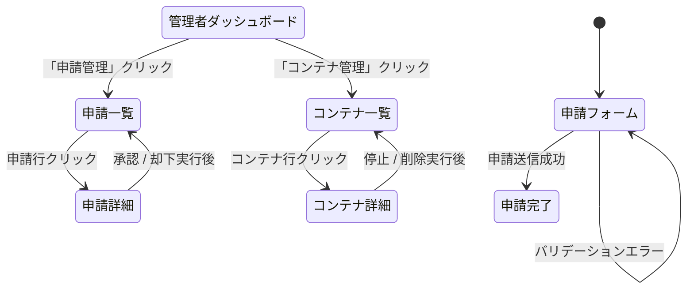
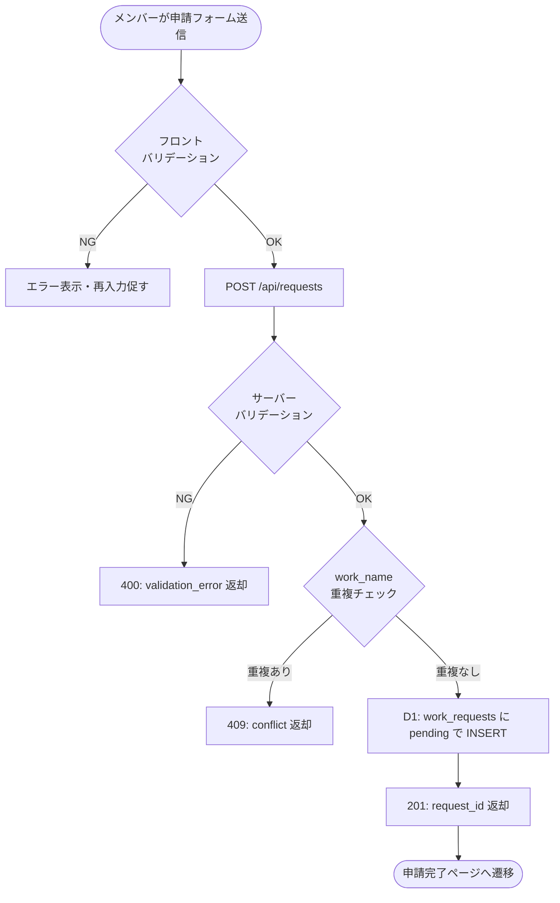
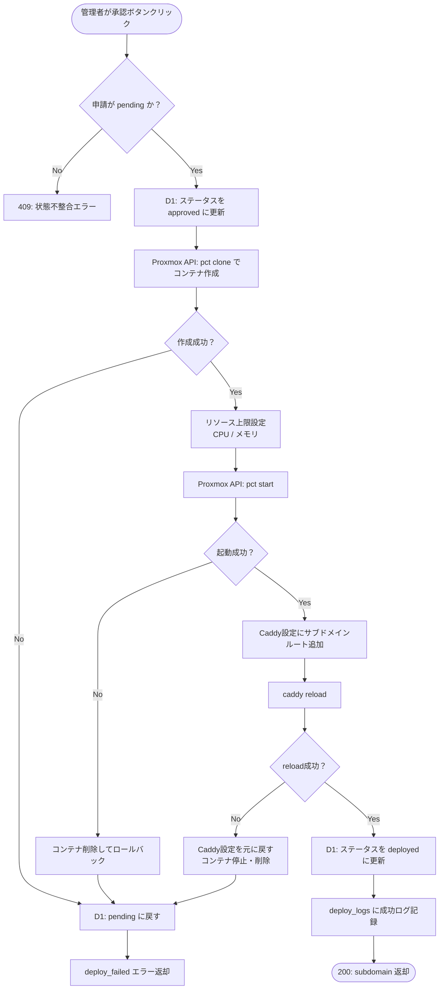
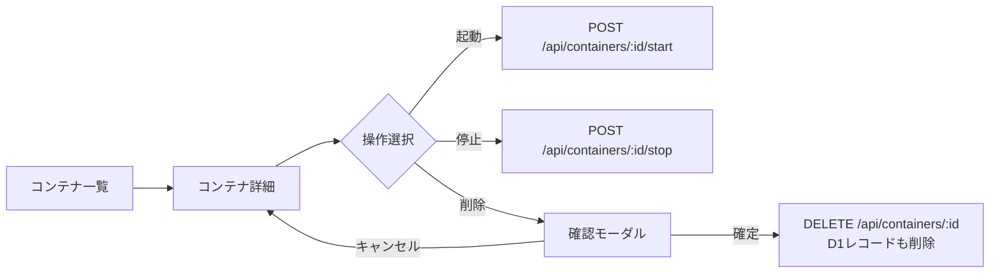

# 🖥️ 画面フロー設計：jyogiverse 管理UI

---

# 0️⃣ 設計前提

| 項目     | 内容                                               |
| ------ | ------------------------------------------------ |
| 対象ユーザー | サークルメンバー（申請者）/ 管理者                          |
| デバイス   | Desktop優先                                        |
| 認証要否   | `/apply` は誰でも可 / `/admin` はCloudflare Accessで外部保護 |
| 権限制御   | アプリ内に認証ロジックなし。Cloudflare Accessに委譲               |
| MVP範囲  | Phase 3 P0画面のみ                                   |

---

# 1️⃣ 画面一覧（Screen Inventory）

| ID   | 画面名          | URL                      | 主要要素                          | 認証    | 優先度 |
| ---- | ------------ | ------------------------ | --------------------------------- | ----- | --- |
| S-01 | 申請フォーム       | `/apply`                 | 作品名・リポジトリURL・言語・申請者名・説明 | 不要    | P0  |
| S-02 | 申請完了         | `/apply/done`            | 申請番号・ステータス確認メッセージ     | 不要    | P0  |
| S-03 | 管理者ダッシュボード   | `/admin`                 | 未承認申請数・稼働コンテナ数          | 管理者   | P0  |
| S-04 | 申請一覧         | `/admin/requests`        | 申請一覧テーブル（フィルタ/ソート付き）  | 管理者   | P0  |
| S-05 | 申請詳細         | `/admin/requests/:id`    | 申請内容・承認/却下ボタン            | 管理者   | P0  |
| S-06 | コンテナ一覧       | `/admin/containers`      | 稼働中コンテナ一覧・リソース使用率      | 管理者   | P0  |
| S-07 | コンテナ詳細       | `/admin/containers/:id`  | コンテナ情報・起動/停止/削除ボタン     | 管理者   | P0  |

---

# 2️⃣ 全体遷移図



---

# 3️⃣ 申請フロー（メンバー視点）



---

# 4️⃣ 承認・デプロイフロー（管理者視点）



---

# 5️⃣ コンテナ操作フロー（管理者視点）



---

# 6️⃣ URL設計

```
/apply                     # 申請フォーム（誰でもアクセス可）
/apply/done                # 申請完了
/admin                     # 管理者ダッシュボード（Cloudflare Accessで保護）
/admin/requests            # 申請一覧
/admin/requests/:id        # 申請詳細・承認/却下
/admin/containers          # コンテナ一覧
/admin/containers/:id      # コンテナ詳細・操作
```

---

# 7️⃣ 申請フォームのバリデーション仕様

| フィールド          | 必須 | 制約                                  | エラーメッセージ例              |
| -------------- | -- | ------------------------------------- | ----------------------- |
| `applicant_name` | ✅ | 1〜50字                                | 「申請者名を入力してください」         |
| `work_name`    | ✅  | 英小文字・数字・ハイフン、3〜30字、重複不可           | 「使用できない文字が含まれています」      |
| `repo_url`     | ✅  | `https://github.com/` で始まるURL        | 「GitHubリポジトリのURLを入力してください」|
| `language`     | ✅  | `nodejs` / `python` / `go` のいずれか     | 「言語を選択してください」           |
| `description`  | ❌  | 最大500字                               | 「500字以内で入力してください」        |
