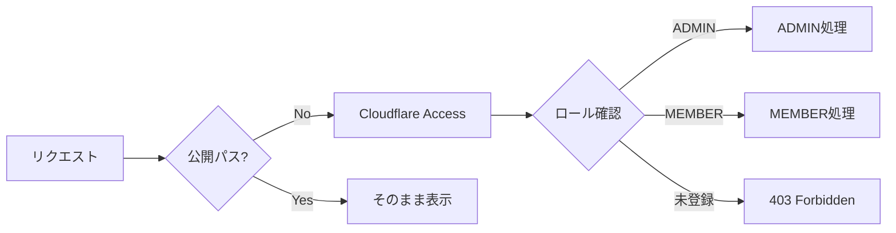

# 🔐 権限設計：jyogiverse

---

# 0️⃣ 設計前提

| 項目      | 内容                                  |
| ------- | ------------------------------------- |
| 権限モデル   | RBAC（シンプル3ロール）                       |
| マルチテナント | なし（単一サークル）                           |
| 認証方式    | Cloudflare Access（Google認証）           |
| スコープ単位  | Global（サービス全体）                       |
| MVP方針   | Phase 3は ADMIN / MEMBER / PUBLIC の3ロール |

---

# 1️⃣ ロール定義

| ロール名   | レベル | 説明                                |
| ------ | --- | --------------------------------- |
| ADMIN  | 100 | 管理者（柳井）。全操作可能。Cloudflare Accessで個別指定。 |
| MEMBER | 10  | サークルメンバー。申請送信・自分の申請状況確認のみ。       |
| PUBLIC | 0   | 未認証・一般閲覧者。公開ページのみ閲覧可能。            |

---

# 2️⃣ 画面アクセス制御

| 画面                 | PUBLIC | MEMBER | ADMIN |
| ------------------- | ------ | ------ | ----- |
| 作品一覧（公開）            | ✅      | ✅      | ✅     |
| 申請フォーム              | ✅      | ✅      | ✅     |
| 申請状況確認（自分の申請のみ）     | ❌      | ✅      | ✅     |
| 管理者ダッシュボード          | ❌      | ❌      | ✅     |
| 申請一覧（全員分）           | ❌      | ❌      | ✅     |
| 申請詳細・承認 / 却下        | ❌      | ❌      | ✅     |
| コンテナ一覧・詳細           | ❌      | ❌      | ✅     |
| コンテナ起動 / 停止 / 削除    | ❌      | ❌      | ✅     |

---

# 3️⃣ 操作権限マトリクス

| 操作                    | PUBLIC | MEMBER | ADMIN |
| --------------------- | ------ | ------ | ----- |
| 作品一覧閲覧                | ✅      | ✅      | ✅     |
| 申請送信                  | ✅      | ✅      | ✅     |
| 自分の申請ステータス確認          | ❌      | ✅      | ✅     |
| 申請一覧閲覧（全員分）           | ❌      | ❌      | ✅     |
| 申請承認 / 却下             | ❌      | ❌      | ✅     |
| コンテナ作成 / 削除           | ❌      | ❌      | ✅     |
| コンテナ起動 / 停止 / 再起動     | ❌      | ❌      | ✅     |
| Caddyルーティング変更         | ❌      | ❌      | ✅     |
| メンバー管理                | ❌      | ❌      | ✅     |

---

# 4️⃣ 認証フロー



---

# 5️⃣ Cloudflare Access設定方針

| 設定項目         | 内容                                       |
| ------------ | ---------------------------------------- |
| 認証プロバイダー     | Google（各自のGoogleアカウント）                   |
| 管理者メール       | 柳井のGmailアドレスを固定登録                        |
| メンバー許可範囲     | メールアドレスを個別登録（サークルメンバーのみ）                 |
| 公開パス（認証不要）   | `/`、`/apply`、`/*.jyogiverse.dev`（各作品URL） |
| 保護パス（認証必須）   | `/status`、`/admin/*`                     |

---

# 6️⃣ Workers側の認証チェック（サーバー最終判定）

```typescript
// Cloudflare Workers（Hono）での権限確認
app.use('/admin/*', async (c, next) => {
  const email = c.req.header('Cf-Access-Authenticated-User-Email')
  if (!email) return c.json({ error: 'Unauthorized' }, 401)

  const member = await db.query.members.findFirst({
    where: eq(members.email, email)
  })
  if (!member || member.role !== 'ADMIN') {
    return c.json({ error: 'Forbidden' }, 403)
  }

  c.set('member', member)
  await next()
})
```

---

# 7️⃣ フロントエンド制御

| パターン     | 説明                                        |
| -------- | ----------------------------------------- |
| 非表示      | 管理者メニュー・承認ボタンはADMINのみ表示                   |
| リダイレクト   | 未認証アクセスはCloudflare Accessが自動的にログイン画面へ     |

※ フロントはUX制御のみ。最終判定は必ずWorkers側（サーバー）で実施。
