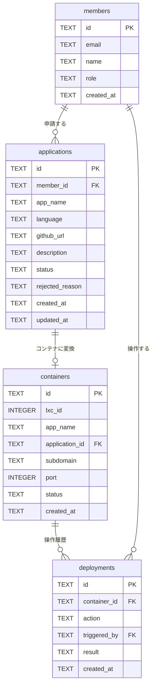
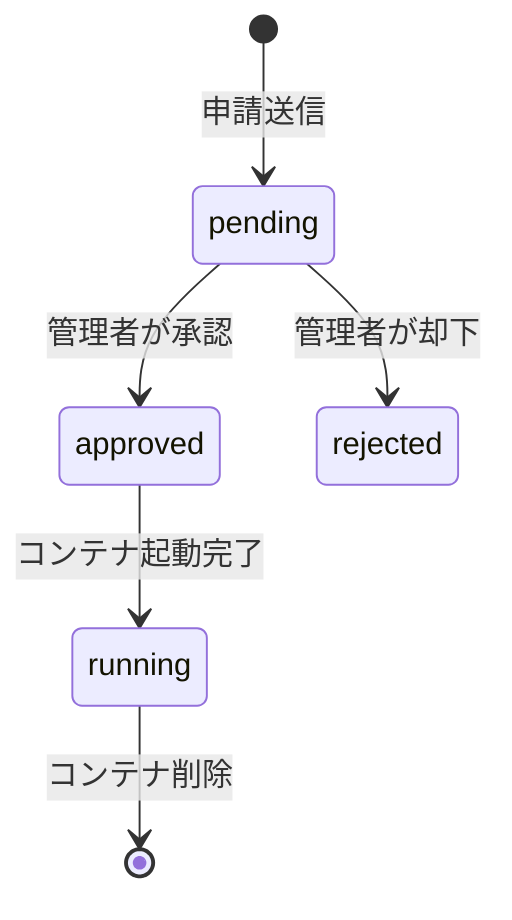

# 🗄️ DB設計書：jyogiverse（Cloudflare D1）

---

# 0️⃣ 設計観点

| 項目    | 内容                                    |
| ----- | --------------------------------------- |
| DB    | Cloudflare D1（SQLite互換）                |
| ID戦略  | UUID（`crypto.randomUUID()`）            |
| 論理削除  | 無（物理削除。操作履歴はdeploymentsテーブルに残す）      |
| 監査ログ  | Phase 2以降でaudit_logsテーブルを追加           |
| 文字コード | UTF-8                                   |

---

# 1️⃣ テーブル一覧

| ドメイン  | テーブル名        | 役割             | Phase |
| ----- | ------------ | -------------- | ----- |
| メンバー  | members      | サークルメンバー情報     | P0    |
| 申請    | applications | ホスティング申請       | P0    |
| コンテナ  | containers   | LXCコンテナ情報      | P0    |
| 操作履歴  | deployments  | コンテナ操作ログ       | P1    |
| 監査    | audit_logs   | 管理UI操作の監査ログ    | P1    |

---

# 2️⃣ ERD



---

# 3️⃣ カラム定義

## members

| カラム        | 型    | 制約              | 説明                     |
| ---------- | ---- | --------------- | ---------------------- |
| id         | TEXT | PK              | UUID                   |
| email      | TEXT | UNIQUE NOT NULL | Cloudflare Accessで取得したGmailアドレス |
| name       | TEXT | NOT NULL        | 表示名                    |
| role       | TEXT | NOT NULL        | `"ADMIN"` / `"MEMBER"` |
| created_at | TEXT | NOT NULL        | ISO 8601               |

---

## applications

| カラム             | 型    | 制約              | 説明                                                    |
| --------------- | ---- | --------------- | ----------------------------------------------------- |
| id              | TEXT | PK              | UUID                                                  |
| member_id       | TEXT | FK              | members.id                                            |
| app_name        | TEXT | UNIQUE NOT NULL | サブドメイン名（英小文字・数字・ハイフンのみ）                               |
| language        | TEXT | NOT NULL        | `"nodejs"` / `"python"` / `"go"` 等                  |
| github_url      | TEXT | NOT NULL        | GitHubリポジトリURL                                        |
| description     | TEXT |                 | アプリ概要（任意）                                             |
| status          | TEXT | NOT NULL        | `"pending"` / `"approved"` / `"rejected"` / `"running"` |
| rejected_reason | TEXT |                 | 却下理由（却下時のみ入力）                                         |
| created_at      | TEXT | NOT NULL        | ISO 8601                                              |
| updated_at      | TEXT | NOT NULL        | ISO 8601                                              |

---

## containers

| カラム            | 型       | 制約              | 説明                                 |
| -------------- | ------- | --------------- | ---------------------------------- |
| id             | TEXT    | PK              | UUID                               |
| lxc_id         | INTEGER | UNIQUE NOT NULL | ProxmoxのCTID（101, 102, …）          |
| app_name       | TEXT    | NOT NULL        | applications.app_nameと同一           |
| application_id | TEXT    | FK              | applications.id                    |
| subdomain      | TEXT    | UNIQUE NOT NULL | `{app_name}.jyogiverse.dev`        |
| port           | INTEGER | NOT NULL        | コンテナ内アプリのリスンポート（3000, 8000 等）     |
| status         | TEXT    | NOT NULL        | `"running"` / `"stopped"` / `"error"` |
| created_at     | TEXT    | NOT NULL        | ISO 8601                           |

---

## deployments

| カラム          | 型    | 制約       | 説明                                                            |
| ------------ | ---- | -------- | ------------------------------------------------------------- |
| id           | TEXT | PK       | UUID                                                          |
| container_id | TEXT | FK       | containers.id                                                 |
| action       | TEXT | NOT NULL | `"create"` / `"start"` / `"stop"` / `"restart"` / `"delete"` |
| triggered_by | TEXT | FK       | members.id（操作した管理者）                                          |
| result       | TEXT | NOT NULL | `"success"` / `"failure"`                                     |
| created_at   | TEXT | NOT NULL | ISO 8601                                                      |

---

# 4️⃣ DDL（D1用 SQLite）

```sql
CREATE TABLE members (
    id TEXT PRIMARY KEY,
    email TEXT UNIQUE NOT NULL,
    name TEXT NOT NULL,
    role TEXT NOT NULL CHECK(role IN ('ADMIN', 'MEMBER')),
    created_at TEXT NOT NULL
);

CREATE TABLE applications (
    id TEXT PRIMARY KEY,
    member_id TEXT NOT NULL REFERENCES members(id),
    app_name TEXT UNIQUE NOT NULL,
    language TEXT NOT NULL,
    github_url TEXT NOT NULL,
    description TEXT,
    status TEXT NOT NULL DEFAULT 'pending'
        CHECK(status IN ('pending', 'approved', 'rejected', 'running')),
    rejected_reason TEXT,
    created_at TEXT NOT NULL,
    updated_at TEXT NOT NULL
);

CREATE TABLE containers (
    id TEXT PRIMARY KEY,
    lxc_id INTEGER UNIQUE NOT NULL,
    app_name TEXT NOT NULL,
    application_id TEXT NOT NULL REFERENCES applications(id),
    subdomain TEXT UNIQUE NOT NULL,
    port INTEGER NOT NULL,
    status TEXT NOT NULL DEFAULT 'running'
        CHECK(status IN ('running', 'stopped', 'error')),
    created_at TEXT NOT NULL
);

CREATE TABLE deployments (
    id TEXT PRIMARY KEY,
    container_id TEXT NOT NULL REFERENCES containers(id),
    action TEXT NOT NULL
        CHECK(action IN ('create', 'start', 'stop', 'restart', 'delete')),
    triggered_by TEXT NOT NULL REFERENCES members(id),
    result TEXT NOT NULL CHECK(result IN ('success', 'failure')),
    created_at TEXT NOT NULL
);
```

---

# 5️⃣ application.status 状態遷移


