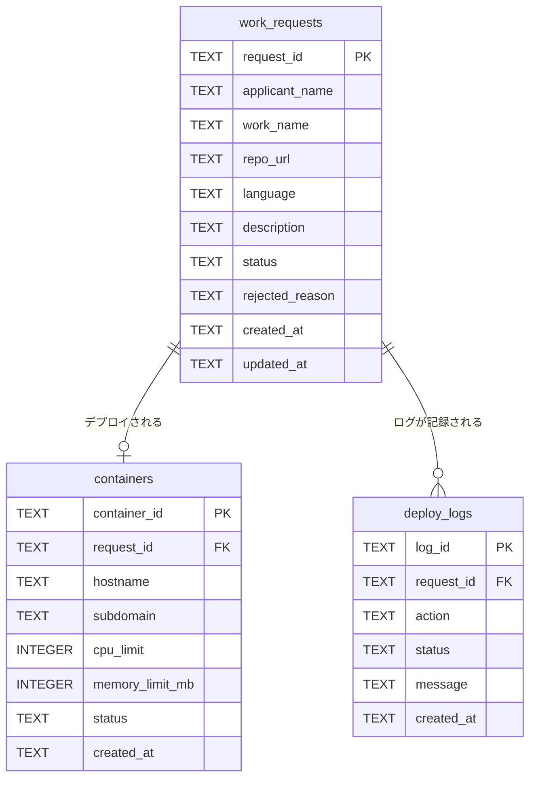
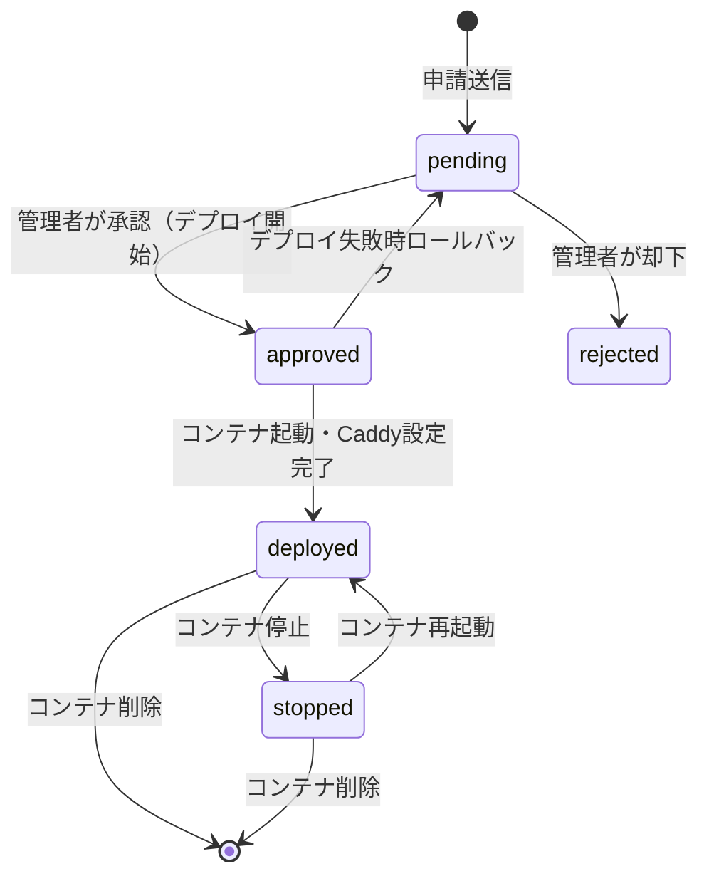

# 🗄️ DB設計書：jyogiverse（Cloudflare D1）

---

# 0️⃣ 設計観点

| 項目    | 内容                                  |
| ----- | ------------------------------------- |
| DB    | Cloudflare D1（SQLite互換）              |
| ID戦略  | UUID（`crypto.randomUUID()`）          |
| 論理削除  | 無（物理削除。操作履歴はdeploy_logsに残す）       |
| 認証    | スコープ外。membersテーブルなし。                |
| 文字コード | UTF-8                                 |

---

# 1️⃣ テーブル一覧

| ドメイン | テーブル名         | 役割                      | Phase |
| ---- | ------------- | ------------------------- | ----- |
| 申請   | work_requests | ホスティング申請（メンバー情報を含む）      | P0    |
| コンテナ | containers    | LXCコンテナ情報（Proxmox側の実態に対応） | P0    |
| 操作履歴 | deploy_logs   | デプロイ・操作ログ                | P0    |

---

# 2️⃣ ERD



---

# 3️⃣ カラム定義

## work_requests

| カラム             | 型    | 制約              | 説明                                                      |
| --------------- | ---- | --------------- | --------------------------------------------------------- |
| request_id      | TEXT | PK              | UUID                                                      |
| applicant_name  | TEXT | NOT NULL        | 申請者名（1〜50字）                                              |
| work_name       | TEXT | UNIQUE NOT NULL | サブドメインに使用。英小文字・数字・ハイフン、3〜30字                            |
| repo_url        | TEXT | NOT NULL        | GitHubリポジトリURL（`https://github.com/` で始まる）              |
| language        | TEXT | NOT NULL        | `"nodejs"` / `"python"` / `"go"`                         |
| description     | TEXT |                 | 作品説明（任意・最大500字）                                          |
| status          | TEXT | NOT NULL        | `"pending"` / `"approved"` / `"rejected"` / `"deployed"` / `"stopped"` |
| rejected_reason | TEXT |                 | 却下理由（却下時のみ入力）                                           |
| created_at      | TEXT | NOT NULL        | ISO 8601 UTC                                              |
| updated_at      | TEXT | NOT NULL        | ISO 8601 UTC（楽観的ロックに使用）                                 |

---

## containers

| カラム             | 型       | 制約              | 説明                                  |
| --------------- | ------- | --------------- | ------------------------------------- |
| container_id    | TEXT    | PK              | ProxmoxのCTID（文字列で保持）                |
| request_id      | TEXT    | FK UNIQUE       | work_requests.request_id（1申請=1コンテナ） |
| hostname        | TEXT    | NOT NULL        | LXCホスト名（work_nameと同一）               |
| subdomain       | TEXT    | UNIQUE NOT NULL | `{work_name}.example.dev`            |
| cpu_limit       | INTEGER | NOT NULL        | CPUコア数上限（デフォルト: 1）                  |
| memory_limit_mb | INTEGER | NOT NULL        | メモリ上限MB（デフォルト: 512）                 |
| status          | TEXT    | NOT NULL        | `"running"` / `"stopped"` / `"error"` |
| created_at      | TEXT    | NOT NULL        | ISO 8601 UTC                          |

---

## deploy_logs

| カラム        | 型    | 制約       | 説明                                                     |
| ---------- | ---- | -------- | -------------------------------------------------------- |
| log_id     | TEXT | PK       | UUID                                                     |
| request_id | TEXT | FK       | work_requests.request_id                                 |
| action     | TEXT | NOT NULL | `"deploy"` / `"start"` / `"stop"` / `"delete"`          |
| status     | TEXT | NOT NULL | `"success"` / `"failure"`                                |
| message    | TEXT |          | 詳細メッセージ（エラー内容等）                                        |
| created_at | TEXT | NOT NULL | ISO 8601 UTC                                             |

---

# 4️⃣ DDL（D1用 SQLite）

```sql
CREATE TABLE work_requests (
    request_id      TEXT PRIMARY KEY,
    applicant_name  TEXT NOT NULL,
    work_name       TEXT UNIQUE NOT NULL,
    repo_url        TEXT NOT NULL,
    language        TEXT NOT NULL CHECK(language IN ('nodejs', 'python', 'go')),
    description     TEXT,
    status          TEXT NOT NULL DEFAULT 'pending'
        CHECK(status IN ('pending', 'approved', 'rejected', 'deployed', 'stopped')),
    rejected_reason TEXT,
    created_at      TEXT NOT NULL,
    updated_at      TEXT NOT NULL
);

CREATE TABLE containers (
    container_id     TEXT PRIMARY KEY,
    request_id       TEXT UNIQUE NOT NULL REFERENCES work_requests(request_id),
    hostname         TEXT NOT NULL,
    subdomain        TEXT UNIQUE NOT NULL,
    cpu_limit        INTEGER NOT NULL DEFAULT 1,
    memory_limit_mb  INTEGER NOT NULL DEFAULT 512,
    status           TEXT NOT NULL DEFAULT 'running'
        CHECK(status IN ('running', 'stopped', 'error')),
    created_at       TEXT NOT NULL
);

CREATE TABLE deploy_logs (
    log_id      TEXT PRIMARY KEY,
    request_id  TEXT NOT NULL REFERENCES work_requests(request_id),
    action      TEXT NOT NULL CHECK(action IN ('deploy', 'start', 'stop', 'delete')),
    status      TEXT NOT NULL CHECK(status IN ('success', 'failure')),
    message     TEXT,
    created_at  TEXT NOT NULL
);
```

---

# 5️⃣ work_requests.status 状態遷移



---

# 6️⃣ 異常系・制約

| 異常パターン          | 対処                                         |
| ------------- | ------------------------------------------ |
| `work_name` 重複 | D1のUNIQUE制約違反 → 409 conflict              |
| 二重承認（同時リクエスト） | `updated_at` 比較による楽観的ロックで検知 → 409 conflict |
| デプロイ失敗        | `status` を `pending` に戻す。deploy_logs に失敗記録 |
