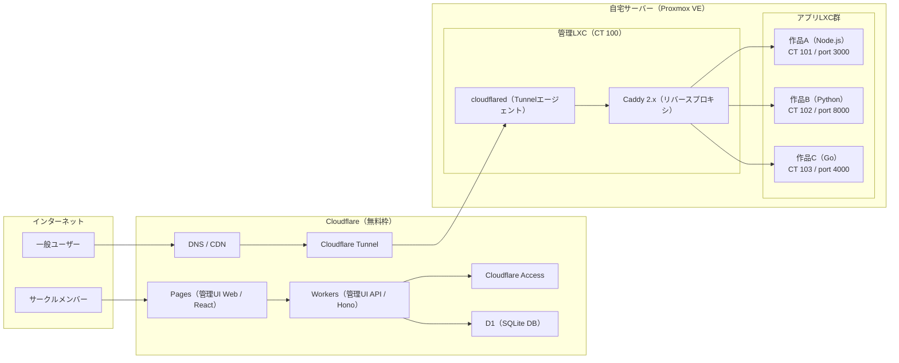
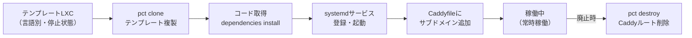

# 🏗️ インフラ設計：jyogiverse

---

# 0️⃣ 設計方針

| 方針           | 内容                                         |
| ------------ | ------------------------------------------ |
| コスト最優先       | 電気代＋ドメイン代のみ。クラウドコストゼロ。                     |
| Proxmox公式範囲内 | LXC直接運用。LXC内のDocker / Podmanは使わない。         |
| ポート開放ゼロ      | Cloudflare Tunnelで外部公開。自宅IPアドレスを公開しない。      |
| 障害点最小化       | 管理LXCとアプリLXCを分離。管理LXCが落ちてもアプリは継続稼働する。     |

---

# 1️⃣ 全体アーキテクチャ



---

# 2️⃣ Proxmox VE構成

| 項目       | 内容                              |
| -------- | --------------------------------- |
| OS       | Proxmox VE 8.x                   |
| リポジトリ    | No-Subscriptionリポジトリを使用          |
| ネットワーク   | vmbr0（ブリッジ）                      |
| ストレージ    | local-lvm（LXCルートディスク）             |
| IPアドレス割当 | LXCごとに固定IP（10.0.0.100〜）         |

## コンテナ構成

| 種別     | CT ID | 役割                        | メモリ上限 | CPU上限 | ディスク |
| ------ | ----- | ------------------------- | ----- | ----- | ---- |
| 管理LXC  | 100   | Caddy + cloudflared常駐      | 512MB | 1コア   | 8GB  |
| アプリLXC | 101〜  | 作品アプリ1つ + systemdサービス     | 256MB | 1コア   | 4GB  |

---

# 3️⃣ LXCコンテナライフサイクル



---

# 4️⃣ Cloudflare Tunnel設定

```yaml
# /etc/cloudflared/config.yaml（管理LXC内）
tunnel: <TUNNEL_ID>
credentials-file: /root/.cloudflared/<TUNNEL_ID>.json

ingress:
  - hostname: "*.jyogiverse.dev"
    service: http://localhost:80    # 管理LXC内のCaddyへ転送
  - service: http_status:404
```

```bash
# cloudflaredをsystemdで常駐
systemctl enable cloudflared
systemctl start cloudflared
```

---

# 5️⃣ Caddy設定（ルーティング）

```caddy
# /etc/caddy/Caddyfile（管理LXC内）

# 作品A（Node.js）
myapp.jyogiverse.dev {
    reverse_proxy 10.0.0.101:3000
}

# 作品B（Python）
gameapp.jyogiverse.dev {
    reverse_proxy 10.0.0.102:8000
}
```

新規デプロイ時は `update-caddy.sh` でCaddyfileにブロックを追記して `caddy reload` する。

---

# 6️⃣ systemdサービス設定テンプレ（アプリLXC内）

```ini
# /etc/systemd/system/{app_name}.service
[Unit]
Description={app_name}
After=network.target

[Service]
Type=simple
User=app
WorkingDirectory=/opt/{app_name}
ExecStart=node server.js          # 言語により変更
Restart=always
RestartSec=5
MemoryLimit=200M
StandardOutput=journal
StandardError=journal

[Install]
WantedBy=multi-user.target
```

```bash
systemctl daemon-reload
systemctl enable {app_name}
systemctl start {app_name}
```

---

# 7️⃣ LXCテンプレート管理

| 言語      | テンプレートCT ID | ベースOS      | 主要インストール内容           |
| ------- | ----------- | ----------- | ---------------------- |
| Node.js | 200         | Debian 12   | Node.js 22 (nvm), npm  |
| Python  | 201         | Debian 12   | Python 3.12, pip, venv |
| Go      | 202         | Debian 12   | Go 1.22                |

テンプレートは停止状態で保持し、`pct clone` でのみ複製する。テンプレート自体は直接使用しない。

---

# 8️⃣ 管理UI インフラ（Cloudflare無料枠）

| コンポーネント          | 無料枠上限           | 予想使用量       |
| ---------------- | --------------- | ----------- |
| Workers          | 10万リクエスト/日      | 〜数十リクエスト/日  |
| Pages            | 500ビルド/月        | 〜10ビルド/月    |
| D1               | 5GB / 500万行書込/月 | 〜1MB程度      |
| Cloudflare Access | 50ユーザーまで無料     | 10〜20ユーザー   |
| Cloudflare Tunnel | 無制限（無料）        | 常時接続1本      |

---

# 9️⃣ 障害対応方針

| 障害パターン          | 対応                                        |
| ------------- | ----------------------------------------- |
| アプリプロセスがクラッシュ | systemdが5秒後に自動再起動（`Restart=always`）        |
| Proxmoxサーバー再起動 | LXCの`onboot=yes`設定で全コンテナが自動起動             |
| 管理LXC（CT100）停止 | アプリLXCは継続稼働。Caddy経由アクセスのみ停止              |
| Cloudflare障害   | アプリへのアクセス不可。インフラ自体には影響なし                 |
| D1障害           | 管理UI停止。インフラ・アプリは継続稼働                     |

---

# 🔟 フォールバック計画

| 問題                     | 逃げ道                                            |
| ---------------------- | ------------------------------------------------ |
| 特定言語がLXCで動かない         | その言語のみLXC + Docker（nesting有効化）で例外対応           |
| Proxmox VEが難しすぎる       | ベアメタル Ubuntu Server + systemd単体構成にフォールバック     |
| Phase 3管理UIが複雑になりすぎる  | HTMLフォーム + シェルスクリプトWebhookで代替                  |
