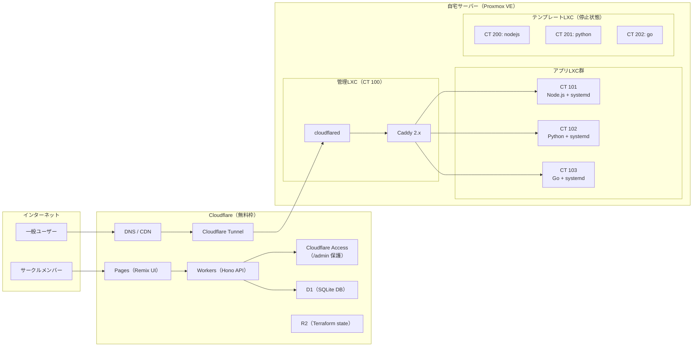
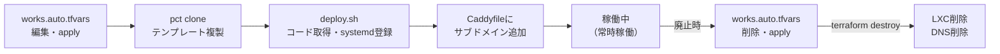

# 🏗️ インフラ設計：jyogiverse

---

# 0️⃣ 設計方針

| 方針           | 内容                                                    |
| ------------ | ------------------------------------------------------- |
| コスト最優先       | 電気代＋ドメイン代のみ。クラウドコストゼロ。                                |
| Proxmox公式範囲内 | LXC直接運用。LXC内のDocker / Podmanは使わない。                    |
| ポート開放ゼロ      | Cloudflare Tunnelで外部公開。自宅IPアドレスを公開しない。                 |
| IaC管理        | TerraformでLXC・Cloudflareリソースをコード管理。手動設定ミスを防ぐ。         |
| 障害点最小化       | 管理LXCとアプリLXCを分離。管理LXCが落ちてもアプリは継続稼働する。               |

---

# 1️⃣ 全体アーキテクチャ



---

# 2️⃣ Proxmox VE構成

| 項目       | 内容                          |
| -------- | ----------------------------- |
| OS       | Proxmox VE 8.x               |
| リポジトリ    | No-Subscriptionリポジトリを使用      |
| ネットワーク   | vmbr0（ブリッジ）                  |
| ストレージ    | local-lvm（LXCルートディスク）         |
| IPアドレス割当 | LXCごとに固定IP（10.0.0.100〜）     |
| API接続    | Proxmox APIトークン（最小権限）をWorkersの環境変数に保持 |

## コンテナ設計

| 種別     | CT ID  | 役割                    | メモリ上限 | CPU上限 | ディスク |
| ------ | ------ | ----------------------- | ----- | ----- | ---- |
| 管理LXC  | 100    | Caddy + cloudflared常駐   | 512MB | 1コア   | 8GB  |
| アプリLXC | 101〜   | 作品アプリ + systemd        | 512MB | 1コア   | 4GB  |
| テンプレート | 200〜   | 言語別テンプレート（停止状態で保持）     | -     | -     | 4GB  |

---

# 3️⃣ IaC管理（Terraform）

Terraformが「存在定義」を担い、Workers APIが「日常操作」を担う。責務を明確に分離する。

```
【リソースのライフサイクル】

作品追加（月1〜2件）
  → works.auto.tfvars を編集
  → git push → CI: terraform plan コメント
  → mainマージ → terraform apply
  → LXC作成・DNS登録が完了

作品の日常操作（起動・停止・ステータス確認）
  → 管理Web UI（Workers API）が担当
  → Terraformは関与しない

作品削除
  → works.auto.tfvarsから削除
  → terraform apply → LXC + DNSレコードが消える
```

### State保管（Cloudflare R2）

```hcl
backend "s3" {
  bucket                      = "tofu-state"
  endpoint                    = "https://<account_id>.r2.cloudflarestorage.com"
  region                      = "auto"
  skip_credentials_validation = true
  skip_metadata_api_check     = true
  skip_region_validation      = true
  force_path_style            = true
}
```

---

# 4️⃣ LXCコンテナライフサイクル



---

# 5️⃣ Cloudflare Tunnel設定

```yaml
# /etc/cloudflared/config.yaml（管理LXC内）
tunnel: <TUNNEL_ID>
credentials-file: /root/.cloudflared/<TUNNEL_ID>.json

ingress:
  - hostname: "*.example.dev"
    service: http://localhost:80    # 管理LXC内のCaddyへ転送
  - service: http_status:404
```

---

# 6️⃣ Caddy設定（ルーティング）

```caddy
# /etc/caddy/Caddyfile（管理LXC内）

{work_name}.example.dev {
    reverse_proxy 10.0.0.{n}:{port}
}
```

承認デプロイ時に `services/deploy.ts` がCaddyfileにブロックを追記して `caddy reload` する。

---

# 7️⃣ systemdサービス設定テンプレ（アプリLXC内）

```ini
# /etc/systemd/system/{work_name}.service
[Unit]
Description={work_name}
After=network.target
OnFailure=notify-discord@%n.service   # 障害時Discord通知

[Service]
Type=simple
User=app
WorkingDirectory=/opt/{work_name}
ExecStart=node server.js
Restart=always
RestartSec=5
MemoryLimit=500M
StandardOutput=journal
StandardError=journal

[Install]
WantedBy=multi-user.target
```

---

# 8️⃣ 管理UI インフラ（Cloudflare無料枠）

| コンポーネント          | 無料枠上限           | 予想使用量      |
| ---------------- | --------------- | ---------- |
| Workers          | 10万リクエスト/日      | 〜数十リクエスト/日 |
| Pages            | 500ビルド/月        | 〜10ビルド/月   |
| D1               | 5GB / 500万行書込/月 | 〜1MB程度     |
| Cloudflare Access | 50ユーザーまで無料     | 1ユーザー（柳井）  |
| Cloudflare Tunnel | 無制限（無料）        | 常時接続1本     |
| R2               | 10GB無料          | 〜数KB（state） |

---

# 9️⃣ SLI/SLO

| SLI                | SLO        | 測定方法                     |
| ------------------ | ---------- | ------------------------ |
| 外形可用性              | 月間99%以上    | Cloudflare Tunnel疎通監視    |
| デプロイ完了時間           | 承認後5分以内    | deploy.tsの実行時間計測         |
| 障害検知時間（MTTD）       | 5分以内       | systemd監視 + Discord通知    |

---

# 🔟 障害対応方針

| 障害パターン            | 対応                                      |
| --------------- | ----------------------------------------- |
| アプリプロセスがクラッシュ   | systemdが5秒後に自動再起動。OnFailureでDiscord通知    |
| Proxmoxサーバー再起動   | LXCの`onboot=yes`で全コンテナが自動起動              |
| 管理LXC（CT100）停止   | アプリLXCは継続稼働。Caddy経由アクセスのみ停止            |
| Cloudflare障害     | アプリへのアクセス不可。インフラ自体には影響なし               |
| D1障害             | 管理UI停止。インフラ・アプリは継続稼働                   |

---

# 11️⃣ フォールバック計画

| 問題                       | 逃げ道                                          |
| ------------------------ | ---------------------------------------------- |
| 特定言語がLXCで動かない           | その言語のみ`nesting=1`でLXC + Docker Engineで例外対応 |
| Proxmox VEが困難            | ベアメタルUbuntu Server + systemd単体構成にフォールバック  |
| Phase 3管理UIが複雑になりすぎる    | HTMLフォーム + シェルスクリプトWebhookで代替               |
