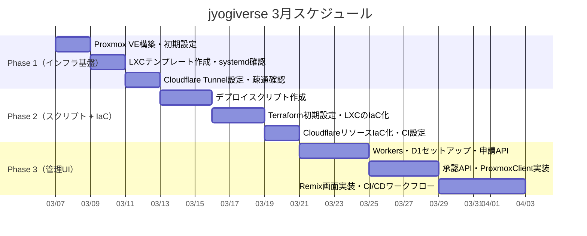

# 🚀 スケジュール・Issue管理：jyogiverse

---

## 📌 前提条件

* 担当者：柳井（1人）
* 見積単位：
  * XS = 2h
  * S = 4h
  * M = 8h
  * L = 16h
  * XL = 24h以上
* 優先度ラベル：
  * 🔴 P0：MVP必須
  * 🟡 P1：早期追加
  * 🟢 P2：中期対応
  * ⚪ P3：将来構想

---

## 3月 スケジュール

| 凡例 | 内容          |
| -- | ----------- |
| ○  | 作業可能（5時間）   |
| △  | 作業可能（2〜3時間） |
| ×  | 作業不可        |

| 日                     | 月                     | 火                     | 水                     | 木                     | 金                     | 土                     |
| :-------------------: | :-------------------: | :-------------------: | :-------------------: | :-------------------: | :-------------------: | :-------------------: |
|                       |                       |                       |                       |                       |                       | **1** 柳井: △        |
| **2** 柳井: ×        | **3** 柳井: ×        | **4** 柳井: △        | **5** 柳井: △        | **6** 柳井: △        | **7** 柳井: ○        | **8** 柳井: ○        |
| **9** 柳井: ○        | **10** 柳井: ○       | **11** 柳井: ○       | **12** 柳井: ○       | **13** 柳井: ○       | **14** 柳井: ○       | **15** 柳井: ○       |
| **16** 柳井: ○       | **17** 柳井: ×       | **18** 柳井: ×       | **19** 柳井: ×       | **20** 柳井: ○       | **21** 柳井: ○       | **22** 柳井: ○       |
| **23** 柳井: ○       | **24** 柳井: ○       | **25** 柳井: ○       | **26** 柳井: △       | **27** 柳井: ○       | **28**       | **29**       |
| **30**       | **31**     |                       |                       |                       |                       |                       |

---

# 🏁 Phase別 Issue一覧

---

## 🏗️ Phase 1：インフラ基盤（Proxmox / LXC / Cloudflare Tunnel）

> 目標：手動で1作品をURLで公開できる状態にする

| #    | タイトル                                       | 工数 | 時間  | 優先度   | 備考                      |
| ---- | ------------------------------------------ | -- | --- | ----- | ----------------------- |
| #001 | Proxmox VEのインストール・初期設定                     | M  | 8h  | 🔴 P0 | No-Subscriptionリポジトリ設定含む |
| #002 | Debian 12 LXCテンプレート作成（Node.js 22、CT200）    | S  | 4h  | 🔴 P0 | npmインストール・appユーザー設定含む   |
| #003 | サンプルアプリをsystemdサービスとして起動確認                  | S  | 4h  | 🔴 P0 | Restart=always・自動復旧の動作確認 |
| #004 | pct cloneでテンプレート複製・動作確認                     | XS | 2h  | 🔴 P0 |                         |
| #005 | 管理LXC（CT100）作成・Caddy 2.xインストール・設定           | S  | 4h  | 🔴 P0 |                         |
| #006 | Cloudflare Tunnel設定・cloudflaredインストール       | S  | 4h  | 🔴 P0 | サブドメインDNS設定含む           |
| #007 | ブラウザからサンプルアプリへのアクセス確認（E2E疎通）               | XS | 2h  | 🔴 P0 | HTTPS動作・Caddy reverse_proxy確認 |
|      | **Phase 1 合計**                             |    | **28h** |    |                         |

---

## 🔧 Phase 2：デプロイスクリプト整備 + IaC（Terraform）

> 目標：スクリプト1本でデプロイが完結し、インフラがコード管理された状態にする

### デプロイスクリプト

| #    | タイトル                                  | 工数 | 時間  | 優先度   | 備考                      |
| ---- | ------------------------------------- | -- | --- | ----- | ----------------------- |
| #010 | create-container.shの作成                | S  | 4h  | 🔴 P0 | pct clone〜Caddy更新まで自動化  |
| #011 | deploy-app.shの作成                      | S  | 4h  | 🔴 P0 | git clone〜systemd起動まで   |
| #012 | delete-container.shの作成                | XS | 2h  | 🔴 P0 | systemd停止〜pct destroy   |
| #013 | Python 3.12テンプレート作成（CT201）           | S  | 4h  | 🟡 P1 | venv設定含む                |
| #014 | Goテンプレート作成（CT202）                    | S  | 4h  | 🟡 P1 |                         |

### IaC（Terraform）

| #    | タイトル                                                | 工数 | 時間  | 優先度   | 備考                                    |
| ---- | --------------------------------------------------- | -- | --- | ----- | --------------------------------------- |
| #015 | Terraformプロジェクト初期設定（versions.tf・R2 backend）         | S  | 4h  | 🔴 P0 | bpg/proxmox + cloudflare Provider設定    |
| #016 | Proxmox LXCのIaC化（main.tf・works.auto.tfvars）        | M  | 8h  | 🔴 P0 | for_each でコンテナ管理・テンプレートIDマッピング         |
| #017 | CloudflareリソースのIaC化（cloudflare.tf）                 | S  | 4h  | 🔴 P0 | DNS・Tunnel・D1・Pages をコード管理             |
| #018 | GitHub Actions IaCワークフロー設定（iac.yml）                | XS | 2h  | 🔴 P0 | PR時 terraform plan コメント / main マージ時 terraform apply |
| #019 | 既存手動リソースの terraform import                         | XS | 2h  | 🔴 P0 | Phase 1で手動作成したリソースをstate取込            |
|      | **Phase 2 合計**                                    |    | **34h** |   |                                         |

---

## 🖥️ Phase 3：管理Web UI実装（Cloudflare Workers + Pages）

> 目標：申請〜承認〜デプロイがUIのボタン操作で完結する状態にする

### バックエンド（Workers / Hono）

| #    | タイトル                                                      | 工数 | 時間  | 優先度   | 備考                              |
| ---- | --------------------------------------------------------- | -- | --- | ----- | --------------------------------- |
| #020 | Cloudflare Workers（Hono）プロジェクト初期セットアップ                   | S  | 4h  | 🔴 P0 | wrangler.toml設定・D1接続・環境変数設定     |
| #021 | D1スキーマ作成・マイグレーション                                         | S  | 4h  | 🔴 P0 | work_requests / containers / deploy_logs |
| #023 | 申請APIの実装（POST /api/requests）                              | S  | 4h  | 🔴 P0 | バリデーション・work_name重複チェック含む      |
| #024 | 申請一覧・詳細APIの実装（GET /api/requests, /api/requests/:id）      | XS | 2h  | 🔴 P0 |                                   |
| #025 | 承認APIの実装（PATCH /api/requests/:id/approve）                 | M  | 8h  | 🔴 P0 | Proxmox API連携・Caddy reload・ロールバック処理 |
| #026 | 却下APIの実装（PATCH /api/requests/:id/reject）                  | XS | 2h  | 🔴 P0 |                                   |
| #029 | コンテナAPIの実装（GET/POST/DELETE /api/containers）               | S  | 4h  | 🟡 P1 | 起動・停止・削除。ProxmoxClient経由         |
| #032 | Workers JSONログ実装（loggerMiddleware）                        | XS | 2h  | 🔴 P0 | 構造化ログ・requestId付与              |

### フロントエンド（Pages / Remix）

| #    | タイトル                                            | 工数 | 時間  | 優先度   | 備考                  |
| ---- | ----------------------------------------------- | -- | --- | ----- | --------------------- |
| #027 | Remix（Cloudflare Pages）プロジェクト初期セットアップ          | XS | 2h  | 🔴 P0 | wrangler pages設定     |
| #028 | 申請フォーム画面の実装（/apply）                             | S  | 4h  | 🔴 P0 | バリデーション表示含む          |
| #033 | 申請一覧・承認画面の実装（/admin/requests）                   | M  | 8h  | 🔴 P0 |                       |
| #034 | コンテナ一覧・詳細画面の実装（/admin/containers）               | M  | 8h  | 🟡 P1 | 起動/停止/削除ボタン含む        |

### CI/CD

| #    | タイトル                                                          | 工数 | 時間  | 優先度   | 備考                                          |
| ---- | ------------------------------------------------------------- | -- | --- | ----- | --------------------------------------------- |
| #035 | CI品質チェックワークフロー設定（quality.yml）                                | S  | 4h  | 🔴 P0 | oxlint / oxc format / stylelint / tsgo / knip / similarity-ts |
| #036 | デプロイワークフロー設定（deploy.yml）                                      | XS | 2h  | 🔴 P0 | wrangler deploy（Workers）+ wrangler pages deploy（Pages） |
|      | **Phase 3 P0合計**                                             |    | **46h** |   |                                               |
|      | **Phase 3 全合計**                                              |    | **58h** |   |                                               |

---

## 🚀 Phase 4：拡張（将来）

| #    | タイトル                                    | 工数 | 時間   | 優先度  | 備考                              |
| ---- | --------------------------------------- | -- | ---- | ---- | --------------------------------- |
| #040 | Git push自動デプロイ（Webhook）                 | XL | 24h  | ⚪ P3 | GitHub Webhooks → Workers経由     |
| #041 | Discord障害通知の強化（フォーマット改善）               | S  | 4h   | 🟢 P2 | systemd OnFailure= + Webhook整備  |
| #042 | 稼働状況バッジ（作品一覧ページ）                       | S  | 4h   | 🟢 P2 |                                   |
| #043 | リソース使用量確認画面                             | M  | 8h   | 🟢 P2 | CPU/メモリ使用率グラフ                  |
| #044 | Cloudflare Access設定（Google認証・管理者保護）     | XS | 2h   | ⚪ P3 | 認証まわりは後回し。インフラ基盤優先             |

---

# 📊 工数サマリー

| フェーズ    | 内容                    | 推定工数     | 担当 |
| ------- | --------------------- | -------- | -- |
| Phase 1 | Proxmox構築・LXC・Tunnel  | 28h      | 柳井 |
| Phase 2 | デプロイスクリプト + IaC整備    | 34h      | 柳井 |
| Phase 3 | 管理Web UI実装（P0のみ）       | 46h      | 柳井 |
| Phase 4 | Git自動デプロイ・拡張機能         | 15〜40h   | 柳井 |
| **合計**  |                       | **108h〜** |    |

---

# 🗓️ フェーズ分解（3月）

---

# 🎯 MVP完了条件（Phase 1終了時点）

- [ ] Proxmox VEが起動している
- [ ] Debian 12 LXC（CT200）でNode.js 22が動作する
- [ ] サンプルアプリがsystemdサービスとして常時稼働している（Restart=always）
- [ ] `pct clone` でテンプレート複製が正常に動作する
- [ ] `{作品名}.example.dev` でブラウザからアクセスできる
- [ ] HTTPS（Cloudflare Tunnel経由）が有効になっている
