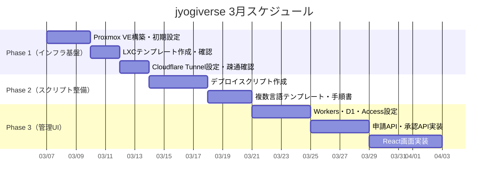

# 🚀 スケジュール・Issue管理：jyogiverse

---

## 📌 前提条件

* 担当者：柳井（1人）
* 見積単位：
  * XS = 2h
  * S = 4h
  * M = 8h
  * L = 16h
  * XL = 24h以上
* 優先度ラベル：
  * 🔴 P0：MVP必須
  * 🟡 P1：早期追加
  * 🟢 P2：中期対応
  * ⚪ P3：将来構想

---

## 3月 スケジュール

| 凡例 | 内容          |
| -- | ----------- |
| ○  | 作業可能（5時間）   |
| △  | 作業可能（2〜3時間） |
| ×  | 作業不可        |

| 日                     | 月                     | 火                     | 水                     | 木                     | 金                     | 土                     |
| :-------------------: | :-------------------: | :-------------------: | :-------------------: | :-------------------: | :-------------------: | :-------------------: |
|                       |                       |                       |                       |                       |                       | **1** 柳井: △        |
| **2** 柳井: ×        | **3** 柳井: ×        | **4** 柳井: △        | **5** 柳井: △        | **6** 柳井: △        | **7** 柳井: ○        | **8** 柳井: ○        |
| **9** 柳井: ○        | **10** 柳井: ○       | **11** 柳井: ○       | **12** 柳井: ○       | **13** 柳井: ○       | **14** 柳井: ○       | **15** 柳井: ○       |
| **16** 柳井: ○       | **17** 柳井: ○       | **18** 柳井: ○       | **19** 柳井: ○       | **20** 柳井: ○       | **21** 柳井: ○       | **22** 柳井: ○       |
| **23** 柳井: ○       | **24** 柳井: ○       | **25** 柳井: ○       | **26** 柳井: △       | **27** 柳井: ○       | **28** 柳井: ○       | **29** 柳井: ○       |
| **30** 柳井: ○       | **31** 柳井: ○       |                       |                       |                       |                       |                       |

---

# 🏁 Phase別 Issue一覧

---

## 🏗️ Phase 1：インフラ基盤（Proxmox / LXC / Cloudflare Tunnel）

> 目標：手動で1作品をURLで公開できる状態にする

### 🔢 推定合計：15〜25h

| #    | タイトル                                       | 工数 | 時間  | 優先度   | 備考                      |
| ---- | ------------------------------------------ | -- | --- | ----- | ----------------------- |
| #001 | Proxmox VEのインストール・初期設定                     | M  | 8h  | 🔴 P0 | No-Subscriptionリポジトリ設定含む |
| #002 | Debian 12 LXCテンプレート作成（Node.js 22）          | S  | 4h  | 🔴 P0 | npmインストール、ユーザー設定含む      |
| #003 | サンプルアプリをsystemdサービスとして起動確認                  | S  | 4h  | 🔴 P0 | 再起動・自動復旧の動作確認           |
| #004 | pct cloneでテンプレート複製・動作確認                     | XS | 2h  | 🔴 P0 |                         |
| #005 | 管理LXC作成・Caddy 2.xインストール・設定                  | S  | 4h  | 🔴 P0 |                         |
| #006 | Cloudflare Tunnelの設定・cloudflaredインストール      | S  | 4h  | 🔴 P0 | サブドメインのDNS設定含む          |
| #007 | ブラウザからサンプルアプリへのアクセス確認                       | XS | 2h  | 🔴 P0 | E2Eの疎通確認                |
|      | **Phase 1 合計**                             |    | **28h** |    |                         |

---

## 🔧 Phase 2：デプロイスクリプト整備

> 目標：スクリプト1本でデプロイが完結する状態にする

### 🔢 推定合計：8〜12h

| #    | タイトル                                  | 工数 | 時間  | 優先度   | 備考                      |
| ---- | ------------------------------------- | -- | --- | ----- | ----------------------- |
| #010 | create-container.shの作成                | S  | 4h  | 🔴 P0 | pct clone〜Caddy更新まで自動化  |
| #011 | deploy-app.shの作成                      | S  | 4h  | 🔴 P0 | git pull〜systemd起動まで    |
| #012 | delete-container.shの作成                | XS | 2h  | 🔴 P0 | systemd停止〜pct destroy   |
| #013 | Python 3.12テンプレート作成                   | S  | 4h  | 🟡 P1 | venv設定含む                |
| #014 | Goテンプレート作成                            | S  | 4h  | 🟡 P1 |                         |
| #015 | デプロイ手順書の整備（README）                    | XS | 2h  | 🟡 P1 |                         |
|      | **Phase 2 合計**                        |    | **20h** |   |                         |

---

## 🖥️ Phase 3：管理Web UI実装（Cloudflare Workers + Pages）

> 目標：申請〜承認〜デプロイがUIのボタン操作で完結する状態にする

### 🔢 推定合計：10〜20h

| #    | タイトル                                      | 工数 | 時間  | 優先度   | 備考                     |
| ---- | ----------------------------------------- | -- | --- | ----- | ---------------------- |
| #020 | Cloudflare Workers（Hono）プロジェクト初期セットアップ   | S  | 4h  | 🔴 P0 | wrangler.toml設定・D1接続   |
| #021 | D1スキーマ作成・マイグレーション                         | S  | 4h  | 🔴 P0 | members, applications, containers |
| #022 | Cloudflare Accessの設定（管理者認証）               | XS | 2h  | 🔴 P0 | Google認証・保護パス設定        |
| #023 | 申請APIの実装（POST /applications）              | S  | 4h  | 🔴 P0 |                        |
| #024 | 申請一覧・詳細APIの実装（GET /applications）          | XS | 2h  | 🔴 P0 |                        |
| #025 | 承認APIの実装（PATCH /applications/:id）         | S  | 4h  | 🔴 P0 | Proxmox APIまたはSSH実行含む  |
| #026 | React（Cloudflare Pages）プロジェクト初期セットアップ   | XS | 2h  | 🔴 P0 |                        |
| #027 | 申請フォーム画面の実装（/apply）                      | S  | 4h  | 🔴 P0 |                        |
| #028 | 申請一覧・承認画面の実装（/admin/applications）        | M  | 8h  | 🔴 P0 |                        |
| #029 | コンテナAPIの実装（GET/POST /containers）          | S  | 4h  | 🟡 P1 | 起動・停止・再起動・削除           |
| #030 | コンテナ一覧・詳細画面の実装（/admin/containers）        | M  | 8h  | 🟡 P1 |                        |
| #031 | 作品一覧画面の実装（/）                             | S  | 4h  | 🟡 P1 | 公開ページ                  |
| #032 | 申請状況確認画面の実装（/status）                     | S  | 4h  | 🟡 P1 | メンバー向け                 |
|      | **Phase 3 P0合計**                        |    | **34h** |   |                        |
|      | **Phase 3 全合計**                         |    | **54h** |   |                        |

---

## 🚀 Phase 4：拡張（将来）

| #    | タイトル                       | 工数 | 時間   | 優先度  | 備考                      |
| ---- | -------------------------- | -- | ---- | ---- | ----------------------- |
| #040 | Git push自動デプロイ（Webhook）    | XL | 24h  | ⚪ P3 | GitHub Webhooks → Workers経由 |
| #041 | Slack通知連携                  | S  | 4h   | 🟢 P2 |                         |
| #042 | 稼働状況バッジ（作品一覧ページ）          | S  | 4h   | 🟢 P2 |                         |
| #043 | リソース使用量確認画面                | M  | 8h   | 🟢 P2 |                         |

---

# 📊 工数サマリー

| フェーズ    | 内容              | 推定工数    | 担当 |
| ------- | --------------- | ------- | -- |
| Phase 1 | Proxmox構築・LXC・Tunnel | 15〜25h | 柳井 |
| Phase 2 | デプロイスクリプト整備     | 8〜12h  | 柳井 |
| Phase 3 | 管理Web UI実装       | 10〜20h | 柳井 |
| Phase 4 | Git自動デプロイ他       | 15〜20h | 柳井 |
| **合計**  |                 | **50〜75h** | |

---

# 🗓️ フェーズ分解（3月）

---

# 🎯 MVP完了条件（Phase 1終了時点）

- [ ] Proxmox VEが起動している
- [ ] Debian 12 LXCでNode.js 22が動作する
- [ ] サンプルアプリがsystemdサービスとして常時稼働している
- [ ] `pct clone` でテンプレート複製が正常に動作する
- [ ] `{作品名}.jyogiverse.dev` でブラウザからアクセスできる
- [ ] HTTPS（Let's Encrypt）が有効になっている
